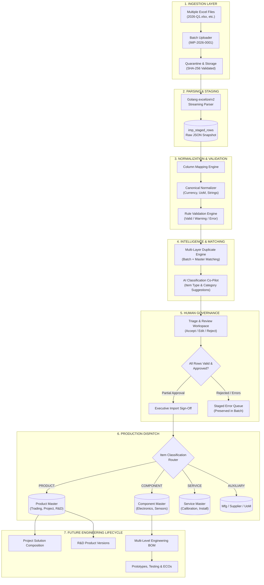

# PRODUCT DATA IMPORT & MASTER DATA MIGRATION
## Detailed Data Flow & Transformation Lifecycle

**DOCUMENT:** Complete Data Pipeline Specification  
**MODULE:** Product Data Import & Master Data Migration  
**SCOPE:** Year 2026 Active Import & Historical Data Preservation  

---

## 1. High-Level System Data Flow



---

## 2. Single Record Transformation Walkthrough

To illustrate the exact data mutations across the pipeline, consider a sample legacy Excel row:

### Stage 1: Raw Excel Input Cell
```
Sheet: "Pricelist_2026" | Row: 142
[ Col A: "Sensor pH Aquas High-Temp 100C" ]
[ Col B: "SEN-PH-001" ]
[ Col C: "Aquas Inc." ]
[ Col D: "Rp 4.500.000" ]
[ Col E: "PCS" ]
[ Col F: "PT. Sensor Indonesia" ]
```

---

### Stage 2: Parser Extraction & Raw Staging (`imp_staged_rows`)
```json
{
  "batch_id": "IMP-2026-0001",
  "sheet_name": "Pricelist_2026",
  "source_row_index": 142,
  "raw_data_snapshot": {
    "Nama Barang": "Sensor pH Aquas High-Temp 100C",
    "Kode Item": "SEN-PH-001",
    "Merk": "Aquas Inc.",
    "Harga Beli": "Rp 4.500.000",
    "Satuan": "PCS",
    "Supplier": "PT. Sensor Indonesia"
  }
}
```

---

### Stage 3: Normalization & Rule Validation
```json
{
  "normalized_data": {
    "name": "pH Sensor Aquas High-Temp 100C",
    "code": "SEN-PH-001",
    "manufacturer_name": "Aquas Inc",
    "unit_cost": 4500000.0000,
    "currency": "IDR",
    "unit": "PCS",
    "supplier_name": "PT Sensor Indonesia"
  },
  "validation_status": "VALID",
  "validation_messages": []
}
```

---

### Stage 4: Duplicate Detection & AI Classification Suggestion
```json
{
  "duplicate_status": "NEW_RECORD",
  "ai_suggested_classification": "PRODUCT",
  "ai_suggested_product_type": "TRADING",
  "ai_suggested_category": "Sensors & Nodes",
  "ai_confidence": 94.5,
  "ai_reasoning": "High-temperature standalone immersion pH probe with manufacturer MPN. Commercial finished unit ready for resale or project integration."
}
```

---

### Stage 5: Human Review & Formally Approved Output
```json
{
  "review_decision": "APPROVED",
  "reviewed_by": "Dr. Sarah Jenkins (R&D Manager)",
  "reviewed_at": "2026-08-31T16:20:00Z",
  "final_item_classification": "PRODUCT",
  "final_product_type": "TRADING",
  "target_master_table": "products"
}
```

---

### Stage 6: Master Data Insertion (`products` Table)
```json
{
  "id": "PRD-2026-008",
  "code": "SEN-PH-001",
  "name": "pH Sensor Aquas High-Temp 100C",
  "product_type": "TRADING",
  "category_id": "CAT-SENSORS",
  "status": "Active",
  "purchase_price": 4500000.00,
  "currency": "IDR",
  "provenance": {
    "batch_code": "IMP-2026-0001",
    "source_file": "2026_Q1_Commercial.xlsx",
    "source_sheet": "Pricelist_2026",
    "source_row": 142
  }
}
```

---

## 3. Master Target Routing Architecture

```
                                  Approved Staged Row
                                           │
                        ┌──────────────────┴──────────────────┐
                        ▼                                     ▼
             Item Classification:                 Item Classification:
                   PRODUCT                              COMPONENT
                        │                                     │
         ┌──────────────┼──────────────┐                      ▼
         ▼              ▼              ▼             `components` Table
      TRADING        PROJECT          RND            (Electronic ICs,
     `products`     `products`     `products`        Sensors, Passives)
       Table          Table          Table
                        │              │
                        │              ▼
                        │     Hardware Versions &
                        │     Multi-Level BOMs
                        ▼
             Project Solutions
          (Turnkey Compositions)
```

---

## 4. Bridge to Downstream Phase 1–6 Lifecycles

Once written to the Master tables, the imported records participate immediately in existing Phase 1–6 engineering lifecycles without any modifications to core business logic:

1. **Phase 1 Master Data:** Products and Components become searchable, filterable, and editable.
2. **Phase 2 & 2C Multi-Level BOMs:** Imported Components and Trading Products can be selected as direct child items in BOM trees.
3. **Phase 3 Multi-Currency Pricing:** Imported IDR/USD purchase costs flow into dynamic BOM cost rollups with live FX rates.
4. **Phase 4 Prototype Builds:** Imported parts are referenced during prototype staging and assembly lot tracking.
5. **Phase 5 Validation & Testing:** Imported sensor devices can be linked to functional validation test benches.
6. **Phase 6 Engineering Changes (ECO):** If a legacy imported component becomes obsolete, formal ECR/ECO change orders can replace it seamlessly.
