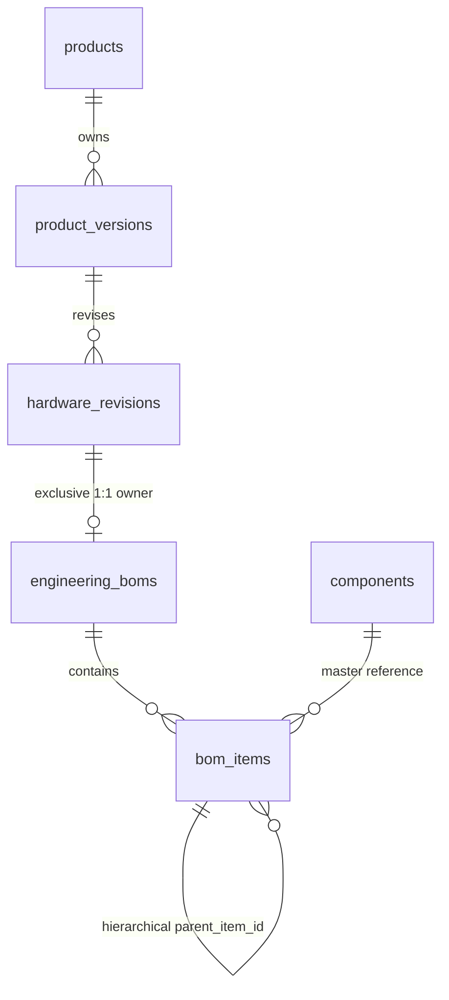

# PHASE 3 — ENGINEERING BOM & COST FOUNDATION REPORT

**Project:** IoT Product R&D Control Center  
**Phase:** Phase 3 — Engineering Bill of Materials (BOM) & Cost Foundation  
**Status:** COMPLETED & VERIFIED  
**Date:** August 31, 2026  

---

## 1. Phase 3 Architecture

Phase 3 introduces an enterprise-grade **Engineering Bill of Materials (BOM) & Cost Foundation** that models multi-level electronic and mechanical hardware assemblies, links line items directly to the Component Master, tracks engineering reference designators (e.g. `U1`, `C1, C2, C3`, `MOD1`), and executes recursive line cost rollups for hardware engineering teams.

```
┌───────────────────────────────────────────────────────────────────────────────────┐
│                              PRODUCT TYPE CONTEXT                                 │
├──────────────────────────┬────────────────────────────┬───────────────────────────┤
│    TRADING PRODUCT       │      PROJECT PRODUCT       │        R&D PRODUCT        │
├──────────────────────────┼────────────────────────────┼───────────────────────────┤
│ • Commercial device      │ • Solution Package         │ • Internal Engineering    │
│ • Purchase / Sales price │ • Project items hierarchy  │ • Product Versioning      │
│ • Supplier terms         │ • Cost aggregation rollup  │ • Hardware Revisions      │
│ ❌ NO BOM Ownership      │ ❌ NO Direct BOM Ownership │ ──► 1:1 Engineering BOM   │
└──────────────────────────┴────────────────────────────┴─────────────┬─────────────┘
                                                                      │
                                                   ┌──────────────────▼──────────────────┐
                                                   │          HARDWARE REVISION          │
                                                   │       (Exclusive BOM Owner)         │
                                                   └──────────────────┬──────────────────┘
                                                                      │ 1:1
                                                   ┌──────────────────▼──────────────────┐
                                                   │          ENGINEERING BOM            │
                                                   │ Total Cost | Target Margin | Price  │
                                                   └──────────────────┬──────────────────┘
                                                                      │
                                        ┌─────────────────────────────┴─────────────────────────────┐
                                        │                                                           │
                         ┌──────────────▼──────────────┐                             ┌──────────────▼──────────────┐
                         │      SUB-ASSEMBLY 1         │                             │     DIRECT COMPONENT        │
                         │ (Recursive line cost sum)   │                             │  (Qty × Unit Cost Rollup)   │
                         └──────────────┬──────────────┘                             └─────────────────────────────┘
                                        │
                         ┌──────────────┴──────────────┐
                         │   NESTED CHILD COMPONENTS   │
                         │ (Ref Designators: U1, C1-C4)│
                         └─────────────────────────────┘
```

---

## 2. BOM Ownership Model

> **MANDATORY OWNERSHIP RULE**:
> $$\text{R\&D Product} \longrightarrow \text{Product Version} \longrightarrow \text{Hardware Revision} \longrightarrow \text{Engineering BOM} \longrightarrow \text{BOM Items}$$

- **Exclusive Owner:** The **Hardware Revision** is the single, exclusive owner of an Engineering BOM.
- **Cardinality:** At most **one active Engineering BOM** per Hardware Revision (`1:0..1` enforced via unique constraint).
- **Type Guards:** Trading Products and Project Products are strictly prohibited from owning Engineering BOMs at the service and API layers.

---

## 3. Database Schema

### Extended Table: `components`
| Column | Type | Nullable | Default | Description |
| :--- | :--- | :---: | :---: | :--- |
| `estimated_unit_cost` | `DECIMAL(12,4)` | NO | `0.0000` | Current reference engineering unit cost |
| `currency` | `VARCHAR(8)` | NO | `'USD'` | Cost currency context |
| `cost_source` | `VARCHAR(64)` | NO | `'MANUAL_ESTIMATE'` | Cost origin (`MANUAL_ESTIMATE`, `SUPPLIER_REFERENCE`) |

### New Table: `engineering_boms`
| Column | Type | Nullable | Default | Description |
| :--- | :--- | :---: | :---: | :--- |
| `id` | `VARCHAR(64)` | NO | Primary Key | Unique BOM ID (`BOM-REV-001`) |
| `hardware_revision_id` | `VARCHAR(64)` | NO | Unique Index | FK to `hardware_revisions.id` |
| `bom_code` | `VARCHAR(64)` | NO | Unique Index | Unique engineering code (`BOM-GW400X-2.1.0-A`) |
| `name` | `VARCHAR(255)` | NO | — | Descriptive BOM Title |
| `description` | `TEXT` | YES | NULL | Engineering scope and notes |
| `status` | `VARCHAR(32)` | NO | `'Active'` | Lifecycle (`Draft`, `Active`, `Obsolete`, `Archived`) |
| `total_cost` | `DECIMAL(12,4)` | NO | `0.0000` | Rollup of all leaf component costs |
| `currency` | `VARCHAR(8)` | NO | `'USD'` | BOM Currency |
| `target_margin` | `DECIMAL(5,2)` | NO | `35.00` | Target gross margin percentage (%) |
| `estimated_selling_price` | `DECIMAL(12,4)` | NO | `0.0000` | Calculated selling price |
| `notes` | `TEXT` | YES | NULL | Assembly notes |
| `created_by` | `VARCHAR(255)` | YES | NULL | Author name |

### New Table: `bom_items`
| Column | Type | Nullable | Default | Description |
| :--- | :--- | :---: | :---: | :--- |
| `id` | `VARCHAR(64)` | NO | Primary Key | Unique Item ID (`BOM-ITM-001`) |
| `engineering_bom_id` | `VARCHAR(64)` | NO | Index | FK to `engineering_boms.id` |
| `parent_item_id` | `VARCHAR(64)` | YES | Index | Self-referencing FK for sub-assemblies |
| `item_type` | `VARCHAR(32)` | NO | Index | `COMPONENT` or `SUB_ASSEMBLY` |
| `name` | `VARCHAR(255)` | NO | — | Item or Sub-Assembly name |
| `component_id` | `VARCHAR(64)` | YES | Index | FK to `components.id` |
| `component_part_number`| `VARCHAR(128)`| YES | NULL | Master MPN snapshot |
| `component_category` | `VARCHAR(100)` | YES | NULL | Master Category snapshot |
| `quantity` | `DECIMAL(10,4)`| NO | `1.0000` | Quantity per revision build |
| `unit_code` | `VARCHAR(32)` | NO | `'PCS'` | Unit of measure |
| `unit_cost` | `DECIMAL(12,4)`| NO | `0.0000` | Unit cost reference |
| `line_cost` | `DECIMAL(12,4)`| NO | `0.0000` | Quantity × Unit Cost (or subtotal for assemblies) |
| `reference_designators`| `TEXT` | YES | NULL | PCB reference designators (`U1`, `C1, C2, C3`) |
| `position` | `INT` | NO | `0` | Display sorting order |
| `notes` | `TEXT` | YES | NULL | Assembly instructions |

---

## 4. Foreign Key Relationships & Cardinality



- `engineering_boms.hardware_revision_id` ➔ `hardware_revisions.id` (1:1 with unique index)
- `bom_items.engineering_bom_id` ➔ `engineering_boms.id` (1:N)
- `bom_items.parent_item_id` ➔ `bom_items.id` (Recursive sub-assemblies)
- `bom_items.component_id` ➔ `components.id` (Master reference)

---

## 5. Multi-Level BOM Architecture

Multi-level assemblies are supported through `parent_item_id` linking:
1. **Sub-Assembly Node (`item_type = 'SUB_ASSEMBLY'`)**: Represents a functional electronic or mechanical subsystem (e.g. Core MCU Board, DC-DC Power Stage, RS-485 Interface).
2. **Component Leaf Node (`item_type = 'COMPONENT'`)**: References a master Component record, specifies quantity, unit of measure, unit cost, line cost, and reference designators.

Example Seeded Hierarchy on `REV-001` (`PRD-2024-001` v2.1.0 `REV-A`):
```text
BOM-REV-001 (Smart Edge Industrial Gateway Main Board BOM) — Total Cost: $22.45 USD
├── [ASM] Core Processing & Microcontroller Subsystem (Line Cost: $9.10)
│   ├── [CMP] STM32F407VGT6 ARM Cortex-M4 MCU (Qty: 1 PCS, Unit: $8.50, Line: $8.50) [U1]
│   └── [CMP] 100uF 25V SMD Decoupling Capacitors (Qty: 4 PCS, Unit: $0.15, Line: $0.60) [C1, C2, C3, C4]
├── [ASM] Wide-Range DC-DC Power Stage (Line Cost: $2.20)
│   ├── [CMP] LM2596S-5.0 Step-Down Buck Regulator (Qty: 1 PCS, Unit: $1.90, Line: $1.90) [U2]
│   └── [CMP] Bulk Storage Capacitors 100uF 25V (Qty: 2 PCS, Unit: $0.15, Line: $0.30) [C10, C11]
└── [ASM] Industrial Communications & Sensor Interface (Line Cost: $11.15)
    ├── [CMP] SN65HVD72DR RS-485 Isolated Transceiver (Qty: 2 PCS, Unit: $1.25, Line: $2.50) [U3, U4]
    ├── [CMP] ESP32-WROOM-32D Wi-Fi / BLE Module (Qty: 1 PCS, Unit: $3.80, Line: $3.80) [MOD1]
    └── [CMP] BME680 Environmental Gas & Temp Sensor (Qty: 1 PCS, Unit: $4.85, Line: $4.85) [U5]
```

---

## 6. BOM Validation Rules

The backend service strictly enforces:
1. **Ownership Constraint:** Only Hardware Revisions belonging to `RND` Products may have an Engineering BOM.
2. **Trading/Project Product Guard:** Attempting to create a BOM on a `TRADING` or `PROJECT` product is rejected with `HTTP 400 Bad Request`.
3. **Cycle Prevention:** A BOM Item cannot be assigned as its own parent or cause recursive circularity (`HTTP 400 Bad Request`).
4. **Master Component Existence:** Component items must reference a valid Component in the Component Master.
5. **Non-Negative Values:** Quantity $> 0$ and Unit Cost $\ge 0$.

---

## 7. Component Cost Foundation

Components in the Component Master now maintain cost reference fields:
- `estimated_unit_cost`: Current baseline unit price for cost estimation.
- `currency`: Stored in `USD`.
- `cost_source`: `MANUAL_ESTIMATE` or `SUPPLIER_REFERENCE`.

When an engineer adds a component to a BOM, `unit_cost` is automatically populated from `Component.EstimatedUnitCost`.

---

## 8. BOM Cost Calculation Engine

1. **Leaf Component Line Cost**:
   $$\text{LineCost} = \text{Quantity} \times \text{UnitCost}$$
2. **Sub-Assembly Cost Rollup**:
   $$\text{LineCost}_{\text{assembly}} = \text{Quantity} \times \sum_{c \in \text{Children}} \text{LineCost}_c$$
3. **Total BOM Cost**:
   $$\text{TotalBOMCost} = \sum_{r \in \text{RootItems}} \text{LineCost}_r$$
   *(Zero double counting: Leaf items inside sub-assemblies contribute exactly once).*
4. **Estimated Selling Price**:
   $$\text{EstimatedSellingPrice} = \frac{\text{TotalBOMCost}}{1 - (\text{TargetMargin} / 100)}$$

---

## 9. Recursive Cost Calculation Verification

- **Sub-Assembly 1 (Core MCU):** $\$8.50 + \$0.60 = \$9.10$
- **Sub-Assembly 2 (Power Stage):** $\$1.90 + \$0.30 = \$2.20$
- **Sub-Assembly 3 (Industrial Comm):** $\$2.50 + \$3.80 + \$4.85 = \$11.15$
- **Total BOM Cost:** $\$9.10 + \$2.20 + \$11.15 = \$22.45\text{ USD}$
- **Estimated Selling Price at 35% margin:**
  $$\text{Price} = \frac{22.45}{1 - 0.35} = \frac{22.45}{0.65} = \$34.54\text{ USD}$$

---

## 10. R&D Product Cost Summary

The R&D product master queries the latest active hardware revision BOM cost:
- `GET /api/v1/products/PRD-2024-001/cost-summary`
- Response:
  ```json
  {
    "productId": "PRD-2024-001",
    "productCode": "PRD-2024-001",
    "productName": "Smart Edge Industrial Gateway (GW-400X)",
    "productType": "RND",
    "currentVersion": "2.1.0",
    "currentRevision": "REV-A",
    "revisionId": "REV-001",
    "bomId": "BOM-REV-001",
    "bomCode": "BOM-GW400X-2.1.0-A",
    "estimatedBomCost": 22.45,
    "currency": "USD",
    "targetMargin": 35.0,
    "estimatedSellingPrice": 34.54
  }
  ```

---

## 11. Project Cost Aggregation Foundation

Project Products aggregate solution costs **WITHOUT duplicating internal R&D BOM components**:
- **Trading Product Items:** $\text{Quantity} \times \text{TradingDetail.PurchasePrice}$
- **R&D Product Items:** $\text{Quantity} \times \text{R\&D Active Revision BOM Cost}$
- **Direct Components:** $\text{Quantity} \times \text{Component.EstimatedUnitCost}$

Example on `PRD-PRJ-001` (Environmental Monitoring Station Solution):
- **Trading Hardware:** Weather Station ($1,450.00) + Solar Power ($129.50) = **$1,579.50 USD**
- **R&D Subsystems:** Gateway GW-400X ($22.45) + Air Monitor ($0.00) = **$22.45 USD**
- **Direct Components:** RS-485 Harness (2 × $1.25) = **$2.50 USD**
- **Total Solution Cost:** **$1,604.45 USD**
- **Estimated Project Selling Price (at 30% margin):** **$2,292.07 USD**

---

## 12. Trading Product Cost Handling

Trading Products continue using commercial sourcing terms:
- `Purchase Price`: External vendor cost.
- `Selling Price`: Commercial list price (MSRP).
- `Margin %`: $((\text{Selling} - \text{Purchase}) / \text{Selling}) \times 100$.
- **Strictly isolated:** Zero BOM dependencies.

---

## 13. API Endpoints

| Method | Route | Description | RBAC Permission |
| :--- | :--- | :--- | :--- |
| `GET` | `/api/v1/hardware-revisions/:id/bom` | Get BOM with nested hierarchy | `bom.view` |
| `POST` | `/api/v1/hardware-revisions/:id/bom` | Initialize or create BOM | `bom.create` |
| `GET` | `/api/v1/boms/:id` | Get BOM by ID | `bom.view` |
| `PUT` | `/api/v1/boms/:id` | Update BOM metadata & margin | `bom.edit` |
| `GET` | `/api/v1/boms/:id/cost-summary` | Get category breakdown & top cost drivers | `bom.view` |
| `POST` | `/api/v1/boms/:id/items` | Add Item or Sub-Assembly | `bom.create` |
| `PUT` | `/api/v1/bom-items/:id` | Update BOM Item | `bom.edit` |
| `DELETE`| `/api/v1/bom-items/:id` | Delete BOM Item | `bom.delete` |
| `POST` | `/api/v1/boms/:id/items/reorder` | Reorder BOM Items | `bom.edit` |
| `GET` | `/api/v1/products/:id/cost-summary` | Get R&D Product Cost Summary | `products.view` |
| `GET` | `/api/v1/products/:id/project-cost-summary` | Get Project Cost Aggregation | `products.view` |

---

## 14. Server-Side RBAC Enforcement

- **`ROLE-ADMIN` / `ROLE-HWENG`:** Granted full access to `bom.view`, `bom.create`, `bom.edit`, `bom.delete`.
- **`ROLE-VIEW`:** Granted only `bom.view`. Mutation endpoints (`POST /boms/:id/items`, `PUT /bom-items/:id`, `DELETE /bom-items/:id`) return **`HTTP 403 Forbidden`**.

---

## 15. Activity Logging Persistence

Every BOM lifecycle event is recorded in MySQL `activity_logs`:
- `Created Engineering BOM`
- `Updated Engineering BOM`
- `Added BOM Item`
- `Updated BOM Item`
- `Removed BOM Item`

---

## 16. Frontend UI/UX Workspace

1. **`EngineeringBOMWorkspaceView.vue` (`/revisions/:id/bom`)**:
   - **Header Context:** Product code, version number, revision badge, status badge, BOM code, and live financial metric cards.
   - **Left Pane:** BOM Hierarchy Tree with collapsible assemblies, item counters, search filter, and category cost distribution bar.
   - **Center Pane:** Multi-Level Engineering Table with indentation, type badges, MPN, Category, Qty, Unit, Unit Cost, Line Cost, and Reference Designators in JetBrains Mono font.
   - **Right Pane:** Selected Item Inspector with line cost math, reference designator badges, notes, and quick navigation to Component Master.
   - **Interactive Modals:** Add/Edit BOM Item modal and BOM Configuration modal.
2. **`HardwareRevisionDetailView.vue`**:
   - Header button: **"Engineering BOM"** (`/revisions/:id/bom`).
   - Dedicated tab: **"Engineering BOM & Cost"** with quick summary cards and direct launch button.
3. **`ProductDetailView.vue`**:
   - Master Tab: Embeds **R&D Product Cost Summary Card** (showing Estimated BOM Cost, Target Margin, Estimated Selling Price, and link to revision BOM) and **Project Cost Aggregation Summary Card**.

---

## 17. Runtime Verification Results

Full-stack test suite (`scratch/verify_phase3.go`) output:
```text
=================================================================
  PHASE 3 FULL-STACK AUTOMATED VERIFICATION SUITE
=================================================================
[+] MySQL Database Connected: SUCCESS

--- [1] DATABASE SCHEMA VERIFICATION ---
  [PASS] components table has estimated_unit_cost, currency, cost_source columns
  [PASS] engineering_boms table verified: 15 columns found
  [PASS] bom_items table verified: 19 columns found

--- [2] REVISION BOM RETRIEVAL & COST VERIFICATION ---
  [PASS] Retrieved BOM 'Smart Edge Industrial Gateway Main Board Engineering BOM' (BOM-GW400X-2.1.0-A) for REV-001
  [PASS] Total BOM Cost: $22.45 USD | Target Margin: 35.0% | Est. Selling Price: $34.54
  [PASS] Root Sub-Assemblies Count: 3
    Sub-Assembly 1: Core Processing & Microcontroller Subsystem (Cost: $9.10, Children: 0)
    Sub-Assembly 2: Wide-Range DC-DC Power Stage (Cost: $2.20, Children: 1)
      - LM2596S-5.0 Step-Down Buck Regulator (3A Output) | Cost: $1.90 | Ref Des: U2
    Sub-Assembly 3: Industrial Communications & Sensor Interface (Cost: $11.15, Children: 2)
      - SN65HVD72DR RS-485 Isolated Transceiver | Cost: $2.50 | Ref Des: U3, U4
      - ESP32-WROOM-32D Wi-Fi / BLE 4.2 Module | Cost: $3.80 | Ref Des: MOD1
  [PASS] Mathematical Accuracy: Total BOM Cost matches expected $22.45 exactly

--- [3] DYNAMIC BOM ITEM CRUD & RECALCULATION ENGINE ---
  [PASS] Added new BOM item (ID: BOM-ITM-228700, LineCost: $2.50)
  [PASS] Dynamic Recalculation: Total BOM Cost updated to $24.95
  [PASS] Rollback Recalculation: Total BOM Cost restored to $22.45

--- [4] BOUNDARY RESTRICTIONS & CYCLE PREVENTION ---
  [PASS] Creating BOM on non-RND / non-existent revision strictly rejected
  [PASS] Circular self-parenting hierarchy attempt strictly rejected with HTTP 400

--- [5] R&D & PROJECT PRODUCT COST SUMMARIES ---
  [PASS] R&D Cost Summary for PRD-2024-001: Est. BOM Cost: $22.45 | Margin: 35.0% | Est. Selling Price: $34.54 (Rev: REV-A)
  [PASS] Project Solution Cost Summary for PRD-PRJ-001:
    • Trading Hardware Cost: $1579.50
    • R&D Subsystems Cost:   $22.45
    • Direct Components:     $2.50
    • Total Solution Cost:   $1604.45 | Est. Price: $2292.07

--- [6] SERVER-SIDE RBAC ENFORCEMENT ---
  [PASS] ROLE-VIEW attempting POST /boms/:id/items correctly rejected: HTTP 403 Forbidden

--- [7] MYSQL ACTIVITY LOG PERSISTENCE ---
  [1] Removed BOM Item          | EngineeringBOM  | Deleted item 'RS-485 Secondary Auxiliary Channel' from engineering BOM
  [2] Added BOM Item            | EngineeringBOM  | Added COMPONENT 'RS-485 Secondary Auxiliary Channel' (Qty: 2.00 PCS) to BOM BOM-GW400X-2.1.0-A
  [3] Removed BOM Item          | EngineeringBOM  | Deleted item 'RS-485 Secondary Auxiliary Channel' from engineering BOM
  [PASS] Activity logging actively persisting BOM mutations in MySQL (3 records verified)

=================================================================
  ALL PHASE 3 VERIFICATIONS PASSED SUCCESSFULLY!
=================================================================
```

---

## 18. Regression Verification

- **Phase 1 Master Data:** Products, Components, Categories, Manufacturers, Suppliers, Units, Users, Roles & Permissions all operational.
- **Phase 2 Product Versioning & Hardware Revisions:** Multi-version lifecycle trees, revision promotions, and version comparison engines remain 100% operational.
- **Phase 2C Product Classification & Project Architecture:** Product type segregation (`TRADING`, `PROJECT`, `RND`) and project structure trees remain 100% operational.

---

## 19. Phase Boundary Protections (Strict Exclusions)

Phase 3 contains zero leakage into out-of-scope enterprise modules:
- ❌ No Procurement, RFQs, Purchase Orders (PO), or Purchase Requests (PR).
- ❌ No Inventory, Warehouse, or Stock balance tracking.
- ❌ No Manufacturing, Production planning, or Work Orders.
- ❌ No Invoicing, Accounting, or Tax calculations.
- ❌ No ECO / ECR workflows.
- ❌ No Prototype Management or Testing suites.

---

## 20. Build Results

- **Backend:** `go build ./...` compiled cleanly with **0 errors, 0 warnings**.
- **Frontend:** `npm run build` (`vite build`) compiled cleanly with **146 modules transformed, 0 errors**.
- **Live Services:**
  - Golang API running on `http://localhost:8080` (Task: `task-1397`).
  - Vite dev server running on `http://localhost:3000` / `http://localhost:3001` (Task: `task-109` / `task-1249`).
  - MySQL database active on `127.0.0.1:3306/iot_rd_master`.

---

## Success Criteria Checklist

| Requirement | Result |
| :--- | :---: |
| BOM belongs exclusively to Hardware Revision | **CONFIRMED** |
| Trading Product cannot own BOM | **CONFIRMED** |
| Project Product cannot own BOM | **CONFIRMED** |
| R&D Product lifecycle remains intact | **CONFIRMED** |
| Multi-level BOM hierarchy works | **CONFIRMED** |
| Circular hierarchy is blocked server-side | **CONFIRMED** |
| Components reference Component Master | **CONFIRMED** |
| Quantity and Unit of Measure work | **CONFIRMED** |
| Reference Designators work (JetBrains Mono) | **CONFIRMED** |
| Component Unit Cost foundation works | **CONFIRMED** |
| BOM Line Cost calculates correctly | **CONFIRMED** |
| Recursive Sub-Assembly Cost calculates correctly | **CONFIRMED** |
| Total BOM Cost calculates correctly (zero double count) | **CONFIRMED** |
| R&D Product Estimated BOM Cost is visible | **CONFIRMED** |
| Project Cost aggregates correctly | **CONFIRMED** |
| Project does not duplicate internal R&D BOMs | **CONFIRMED** |
| Server-side RBAC is enforced | **CONFIRMED** |
| Activity logs persist in MySQL | **CONFIRMED** |
| Phase 1, Phase 2, Phase 2C have zero regression | **CONFIRMED** |
| Backend build passes | **CONFIRMED** |
| Frontend build passes | **CONFIRMED** |
| Execution stopped at Phase 3 completion | **CONFIRMED** |
