# PRODUCT DATA IMPORT & MASTER DATA MIGRATION
## Comprehensive System Architecture Specification

**MODULE NAME:** Product Data Import & Master Data Migration  
**MODULE CLASSIFICATION:** Cross-Cutting Platform Foundation Capability (Non-Phase 7)  
**ACTIVE INITIAL SCOPE:** Year 2026 Datasets (2016–2025 Historical Archive)  
**ENGINEERING CONTEXT:** Supporting Phases 1–6 (Master Data, BOM, Revisions, Testing, ECO)  
**STATUS:** **DESIGN & ARCHITECTURE COMPLETE (GO)**  

---

## 1. Executive Summary & Business Intent

The **Product & Master Data Control Center** manages three distinct product archetypes (**TRADING**, **PROJECT**, and **IN-HOUSE R&D**) resting on a centralized Master Data foundation. 

Historically, enterprise engineering, commercial procurement, and project sales data (spanning 2016 to 2026) reside in mixed Excel workbooks (`.xlsx` / `.xls`). These legacy sheets contain heterogeneous rows:
- **Finished Products** (Smart gateways, multi-sensor nodes, telemetry devices)
- **Direct Components & Sensors** (Environmental sensors, ICs, passives, modules)
- **Spare Parts & Accessories** (Enclosures, brackets, cable harnesses, antennas)
- **Engineering Services & Operational Costs** (Calibration, field installation, mobilization, site testing, maintenance warranties)

### Core Mandate:
1. **Never Assume Every Row is a Product:** Rows must undergo deterministic parsing, rule-based normalization, duplicate detection, and AI-assisted classification before touching production tables.
2. **Zero Direct Production Writes:** All incoming data is staged in dedicated import batch tables (`imp_batches`, `imp_files`, `imp_staged_rows`).
3. **2026-First Strategy:** Year 2026 records represent the active migration scope. Years 2016–2025 remain preserved as traceable historical audit sources.
4. **Absolute Data Provenance:** Every master record created must trace back to `Batch Code + Source File + Sheet Name + Row Index + Original Cell Snapshot`.

---

## 2. End-to-End System Data Flow

```
┌─────────────────────────────────────────────────────────────────────────────┐
│ 1. SOURCE WORKBOOKS (Multiple .XLS / .XLSX Files, e.g. 2026-Q1.xlsx)       │
└──────────────────────────────────────┬──────────────────────────────────────┘
                                       │ Multipart Upload (SHA-256 + MIME)
                                       ▼
┌─────────────────────────────────────────────────────────────────────────────┐
│ 2. IMPORT BATCH STAGING LAYER (IMP-2026-XXXX)                               │
│    • Stored in isolated staging schema (imp_batches / imp_files)            │
│    • Files quarantined and scanned                                          │
└──────────────────────────────────────┬──────────────────────────────────────┘
                                       │ Golang Stream Processing
                                       ▼
┌─────────────────────────────────────────────────────────────────────────────┐
│ 3. DETERMINISTIC EXCEL PARSER (excelize/v2)                                 │
│    • Sheet enumeration & header detection                                   │
│    • Cell extraction & formula evaluation safety (No macro execution)       │
│    • Preserves original raw strings                                         │
└──────────────────────────────────────┬──────────────────────────────────────┘
                                       │ Raw Row Staging
                                       ▼
┌─────────────────────────────────────────────────────────────────────────────┐
│ 4. NORMALIZATION & COLUMN MAPPING ENGINE                                    │
│    • User/Auto Column Mapping (Source Header ➔ Master Field)                │
│    • Canonical formatting: Currency (IDR/USD), Dates, UoM (pcs, unit, m)    │
│    • String trimming, casing, and number sanitization                       │
└──────────────────────────────────────┬──────────────────────────────────────┘
                                       │ Normalization Pipeline
                                       ▼
┌─────────────────────────────────────────────────────────────────────────────┐
│ 5. RULE-BASED VALIDATION ENGINE                                             │
│    • Mandatory field checks (Name, Category, UoM)                           │
│    • Data type & numeric range verification                                 │
│    • Generates VALID, WARNING, or ERROR row-level flags                     │
└──────────────────────────────────────┬──────────────────────────────────────┘
                                       │ Validated Rows
                                       ▼
┌─────────────────────────────────────────────────────────────────────────────┐
│ 6. MULTI-LAYER DUPLICATE DETECTION ENGINE                                   │
│    • Match against Active Batch (intra-file duplicates)                     │
│    • Match against Product Master (Exact Code, Normalized Name)             │
│    • Match against Component Master (MPN, Manufacturer + MPN)               │
│    • Flags: NEW_RECORD, POSSIBLE_DUPLICATE, MATCHED_EXISTING                │
└──────────────────────────────────────┬──────────────────────────────────────┘
                                       │ Staged Context
                                       ▼
┌─────────────────────────────────────────────────────────────────────────────┐
│ 7. AI CLASSIFICATION & DATA CLEANSING (Optional Co-Pilot)                   │
│    • Heuristic + LLM suggestion: Item Type, Product Type, Category          │
│    • Confidence Score (e.g. 94% Confidence)                                │
│    • OUTPUT = SUGGESTION ONLY (Never writes directly to master)             │
└──────────────────────────────────────┬──────────────────────────────────────┘
                                       │ Review Grid
                                       ▼
┌─────────────────────────────────────────────────────────────────────────────┐
│ 8. HUMAN REVIEW & TRIAGE WORKSPACE                                          │
│    • Engineering Reviewer accepts, edits, or overrides AI suggestions       │
│    • Row-by-row triage: APPROVE, REJECT, MERGE, or EDIT                     │
│    • Partial approvals supported (Valid rows not blocked by error rows)     │
└──────────────────────────────────────┬──────────────────────────────────────┘
                                       │ Final Sign-Off (Role: Approver)
                                       ▼
┌─────────────────────────────────────────────────────────────────────────────┐
│ 9. ATOMIC MASTER DATA DISPATCHER & PROVENANCE COMMIT                        │
│    • Routes approved items to target tables:                                │
│        ├─ Item Type = PRODUCT   ➔ products table (TRADING, PROJECT, RND)    │
│        ├─ Item Type = COMPONENT ➔ components table                          │
│        ├─ Item Type = SERVICE   ➔ service_items table                       │
│        └─ Auxiliary Master      ➔ manufacturers / suppliers / uoms          │
│    • Writes immutable audit provenance link to source row                   │
└─────────────────────────────────────────────────────────────────────────────┘
```

---

## 3. Parser Architecture (Golang `excelize/v2`)

The backend parser utilizes `github.com/xuri/excelize/v2` configured strictly for **read-only deterministic cell extraction**.

### Separation of Concerns:
```
┌──────────────────────────────────────┬──────────────────────────────────────┐
│ PARSER RESPONSIBILITIES (DETERMINISTIC)│ DOWNSTREAM LOGIC (BUSINESS RULES)   │
├──────────────────────────────────────┼──────────────────────────────────────┤
│ • File open & stream decoding        │ • Business Category classification   │
│ • Sheet enumeration & dimension scan │ • Product Type (Trading/Project/R&D) │
│ • Header row candidate detection     │ • Duplicate resolution logic         │
│ • Cell value extraction (strings)    │ • AI suggestion acceptance           │
│ • Formula text extraction (safe mode)│ • Foreign key mapping                │
│ • Number format extraction           │ • Final Master Data generation       │
└──────────────────────────────────────┴──────────────────────────────────────┘
```

### Security & Safety Constraints:
1. **No Macro Execution:** VBA macros and embedded scripts are strictly ignored and stripped during parsing.
2. **Formula Injection Defense:** Formula cells (`=SUM()`, `=HYPERLINK()`) are parsed for computed static values only; formula strings starting with `=`, `+`, `-`, or `@` are sanitized.
3. **Memory Limits:** Files are processed with streaming reader `excelize.Rows()` to support files with $50,000+$ rows without unbounded RAM spikes.

---

## 4. Import Staging Database Architecture

```mermaid
erDiagram
    imp_batches ||--o{ imp_files : contains
    imp_files ||--o{ imp_staged_rows : extracts
    imp_staged_rows ||--o{ imp_row_audits : tracks
    
    imp_batches {
        string id PK
        string batch_code UK
        string import_year
        string source_type
        string status
        int files_count
        int total_rows
        int valid_rows
        int warning_rows
        int error_rows
        int approved_rows
        int rejected_rows
        string uploaded_by
        datetime created_at
    }

    imp_files {
        string id PK
        string batch_id FK
        string original_filename
        string stored_filepath
        string file_sha256
        int file_size_bytes
        int sheet_count
        json sheet_manifest
        string status
    }

    imp_staged_rows {
        string id PK
        string batch_id FK
        string file_id FK
        string sheet_name
        int source_row_index
        json raw_data_snapshot
        json normalized_data
        string item_classification
        string product_type
        string target_category_id
        string target_mfg_id
        string target_supplier_id
        decimal unit_cost
        string currency
        string validation_status
        json validation_messages
        string duplicate_status
        string matched_master_id
        string matched_master_type
        string ai_suggested_type
        decimal ai_confidence
        json ai_payload
        string review_decision
        string reviewed_by
        string target_master_table
        string target_master_id
        datetime created_at
    }

    imp_row_audits {
        string id PK
        string row_id FK
        string action
        string performed_by
        json previous_state
        json new_state
        datetime timestamp
    }
```



---

## 5. Item Classification vs. Product Archetype Model

The import module enforces a clean two-dimensional taxonomy to prevent mixing raw components and commercial services with finished products.

### Dimension 1: Item Classification (`item_classification`)
- `PRODUCT`: Finished standalone unit, assembly, or turnkey device.
- `COMPONENT`: Electronic component, sensor element, microcontroller, passive.
- `SPARE_PART`: Replacement module, enclosure, sub-assembly, bracket.
- `ACCESSORY`: External antenna, power supply adapter, mounting kit, cable.
- `SERVICE`: Engineering calibration, field mobilization, installation, maintenance.
- `CONSUMABLE`: Solder paste, thermal pads, screws, zip ties.
- `OTHER`: Unclassified line item requiring manual review.

### Dimension 2: Product Type (`product_type`) — Active ONLY when `Item Classification = PRODUCT`
- `TRADING`: Commercially sourced third-party product (reseller margin, no BOM/ECO).
- `PROJECT`: Customer-specific turnkey solution combining Trading parts and R&D assemblies.
- `RND`: Proprietary hardware lifecycle product (governed by Versions, BOM, Protocols, ECOs).

---

## 6. Multi-Layer Duplicate Detection Logic

| Layer | Target | Match Method | Resulting Flag |
| :--- | :--- | :--- | :--- |
| **Layer 1: Batch Intra-Check** | Staged rows in same batch | Exact code or MPN match | `DUPLICATE_IN_BATCH` |
| **Layer 2: Product Master** | `products` table | `code == row.code` OR `UPPER(name) == UPPER(row.name)` | `MATCHED_EXISTING_PRODUCT` |
| **Layer 3: Component Master** | `components` table | `part_number == row.mpn` OR `(mfg_id + mpn)` | `MATCHED_EXISTING_COMPONENT` |
| **Layer 4: Fuzzy Match** | Master catalogs | Levenshtein distance $> 85\%$ on sanitized name | `POSSIBLE_DUPLICATE` (Review Required) |
| **Layer 5: Unique** | All master tables | No collision detected | `NEW_RECORD` |

---

## 7. Data Provenance & Lineage Architecture

To ensure 100% enterprise auditability, whenever a record is approved and written to production, the target table retains a **Master Provenance Envelope**:

```json
{
  "provenance": {
    "source_type": "EXCEL_IMPORT",
    "import_batch_id": "IMP-2026-0001",
    "source_year": "2026",
    "source_file": "2026_Q1_Sensors_Master.xlsx",
    "source_sheet": "Sheet1_Commercial",
    "source_row": 142,
    "imported_by": "Alex Chen (alex.chen@iotcontrol.io)",
    "imported_at": "2026-08-31T16:15:00Z",
    "raw_row_snapshot": {
      "Nama Barang": "pH Sensor Aquas High-Temp 100C",
      "Kode Item": "SEN-PH-001",
      "Merk": "Aquas Inc",
      "Harga Beli": "Rp 4.500.000",
      "Satuan": "PCS",
      "Kategori": "Sensors"
    }
  }
}
```

---

## 8. Role-Based Access Control (RBAC) Specification

| Permission Code | Name | Description | Super Admin | Hardware Lead | R&D Manager | Viewer |
| :--- | :--- | :--- | :---: | :---: | :---: | :---: |
| `dataimport.view` | View Import Batches | View import dashboard, batches, files, and staged status | ✓ | ✓ | ✓ | ✓ |
| `dataimport.upload` | Upload Datasets | Upload new XLS/XLSX workbooks and create batches | ✓ | ✓ | ✓ | ✗ |
| `dataimport.validate` | Run Validation & Normalization | Trigger parser, normalization rules, and mapping | ✓ | ✓ | ✓ | ✗ |
| `dataimport.ai` | Trigger AI Co-Pilot | Request AI classification suggestions & confidence | ✓ | ✓ | ✓ | ✗ |
| `dataimport.review` | Triage Staged Rows | Accept/reject rows, override classifications, edit values | ✓ | ✓ | ✓ | ✗ |
| `dataimport.approve` | Authorize Batch Release | Formally approve validated rows for master migration | ✓ | ✗ | ✓ | ✗ |
| `dataimport.execute` | Commit to Master Data | Trigger atomic master table insertion | ✓ | ✗ | ✓ | ✗ |

---

## 9. Development History & Platform Placement

This capability is explicitly categorized under **Cross-Cutting Platform Foundation Capabilities**, alongside Authentication, JWT Session Guard, and Multi-Currency FX Engine.

```
PLATFORM FOUNDATION
├── 1. REST API Engine (Gin + GORM)
├── 2. MySQL 8.0 Master Storage Engine
├── 3. JWT Authentication & Session Guard
├── 4. Enterprise RBAC Security Matrix
├── 5. Multi-Currency Live FX Engine
└── 6. Product Data Import & Master Data Migration (DESIGN COMPLETE)
```

**Existing Engineering Lifecycle Phases 1 to 6 remain 100% COMPLETE and unmodified.** No Phase 7 is created.
